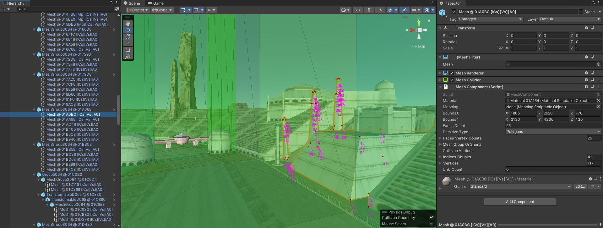

# swe1r-assets-unity

A Unity package (WIP, currently just a sample project) that allows you to import, modify and re-export assets of the game Star Wars Episode I: Racer.

Based on [swe1r-assets](https://github.com/akopetsch/swe1r-assets), it allows for bit-perfect re-exporting, meaning that if you import a block item (e.g., a model), make no changes in the Unity Editor, and export it again, the output binary data will be identical to the input data. Changing certain values will only alter the respective bytes in the output.

https://github.com/akopetsch/swe1r-assets-unity/assets/8048046/0094fd64-4f0f-4609-84a5-ff9c674e4f5c

Imported OBJ model is by [Leadphalanx](https://forums.tigsource.com/index.php?topic=68973.0).

